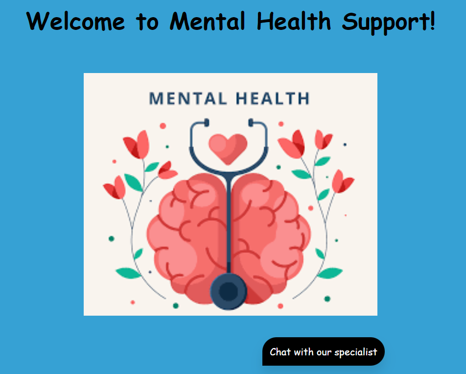
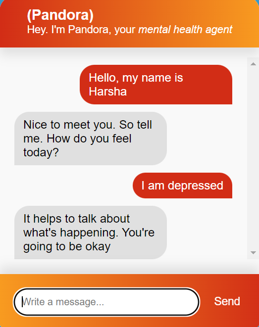
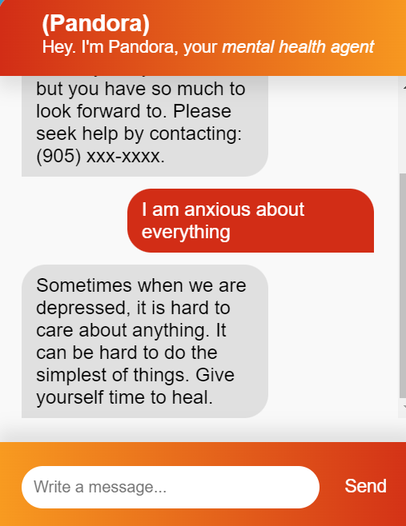

# Mental Health Chatbot

## Project Description

Mental health is a vital aspect of overall well-being, yet many individuals face barriers in accessing the support they need. 

Introducing Pandora, the mental health assistant that makes you feel better!

Pandora is a chatbot that uses Natural Language Processing techniques that understands users' problems and generates a response accordingly. It is built using a `Flask` backend, `NLTK`, `Tensorflow`, and `Keras` for model training, and `JavaScript` for frontend.

## UI



<table>
  <tr>
  <td>
  
  </td>
  <td>
  
  </td>
  </tr>
</table>

## Project Setup

1. Install the required python dependencies

```
pip install -r requirements.txt
```

2. <em>(Optional)</em> Train the chatbot model on the intents. You can also add intents of your own in `intents.json`
```
python ./train_chatbot.py
```

3. Run the flask app on `http://127.0.0.1:5000/`

```
flask --app app.py run
```

